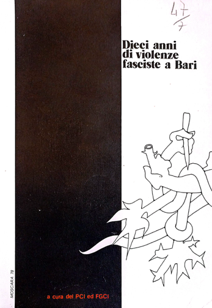

# Mappa della violenza neofascista a Bari (1968–1978)

Questa mappa interattiva visualizza gli episodi di violenza neofascista avvenuti a Bari tra il 1968 e il 1978. L'episodio più noto è costituito dall’aggressione del 28 novembre 1977, in cui fu ucciso Benedetto Petrone, giovane militante della Federazione Giovanile Comunista Italiana (FGCI), accoltellato da membri del Fronte della Gioventù (FdG) in piazza Prefettura, al confine tra città vecchia e borgo murattiano. L'assassinio di Petrone scatenò una mobilitazione antifascista imponente nelle giornate del 29 e 30 novembre 1977.  

Nonostante Bari fosse ritenuta una «città tranquilla», nei dieci anni precedenti al delitto Petrone, erano stati registrati circa 150 episodi di violenza riconducibili alla destra neofascista. I dati sono desumibili dal dossier realizzato da PCI e FGCI nel 1978, intitolato *Dieci anni di violenze fasciste a Bari*. Attraverso l'identificazione dei luoghi descritti nel dossier, è stato possibile geolocalizzare 128 episodi di violenza. Stante la provenienza politica della fonte, 73 episodi sono stati validati attraverso l'associazione ad articoli di cronaca comparsi sulla stampa dell’epoca (*La Gazzetta del Mezzogiorno* e *l’Unità*). I nomi di autori e vittime delle violenze sono stati indicati attraverso le sole iniziali, a eccezione dell'episodio del 28 novembre 1977. La mappa permette di esplorare la distribuzione spaziale della violenza neofascista, in relazione ai quartieri cittadini, alle aree di concentrazione giovanile e alle sedi politiche e culturali.

La ricerca è stata presentata il 6 giugno 2025 presso l'Università di Helsinki (Finlandia) nel contesto della conferenza "[Imagining the Anti-Fascist City](https://www.helsinki.fi/en/conferences/imagining-anti-fascist-city)". Analisi e considerazioni più approfondite saranno pubblicate negli atti della conferenza.

---

## 🗺️ Come usare la mappa

La mappa è navigabile a partire dalla pagina `index.html` e in maniera più immediata attraverso il seguente link: https://vcolaprice1.github.io/bari_viol68-78/.
Il dataset è disponibile per la consultazione anche sulla piattaforma Zenodo: [

**Controlli disponibili:**
- Puoi attivare o disattivare i livelli dal pannello in alto a destra:
  - **Quartieri**: confini amministrativi dei quartieri di Bari (attuali).
  - **Violenze**: episodi di violenza neofascista (1968–1978), clusterizzati per una migliore leggibilità.
  - **Sedi politiche e culturali**: luoghi relativi a partiti, movimenti e realtà culturali e/o ricreative associati a movimenti di destra e sinistra.
  - **Aree studentesche**: zone di aggregazione scolastica e/o universitaria.

**Funzionalità interattive:**
- I punti sono clusterizzati e si separano con lo zoom.
- Cliccando su un punto, è possibile visualizzare un popup che restituisce i dettagli dell’episodio.
- In basso a destra è disponibile una minimappa che aiuta nell’orientamento.

---

## 📚 Fonti

- PCI e FGCI (a cura di), *Dieci anni di violenze fasciste a Bari*. Bari, 1978.
- *La Gazzetta del Mezzogiorno*.
- *L’Unità*.
- Cartografia storica del Comune di Bari (1971): [Cartografie storiche](https://www.comune.bari.it/web/edilizia-e-territorio/cartografie-storiche).

**Bibliografia ulteriore:**
- Pasquale Martino e Nicola Signorile, *Le due città: i giorni di Bendedetto Petrone*. Bari: Libreria Cooperativa, 1978.
- Carlo Schaerf, Giuseppe De Lutiis, Alessandro Silj, Francesco Carlucci, Emilio Bellucci, Stefania Argentini, *Venti anni di violenza politica in Italia: 1969-1988*, voll. 4. Roma: Università degli Studi “La Sapienza”, 1992.
- Guido Panvini, *Ordine nero, guerriglia rossa: la violenza politica nell’Italia degli anni Sessanta e Settanta (1966-1975)*. Torino: Einaudi, 2009.
- Davide Conti, *L'anima nera della Repubblica: storia del MSI*. Bari-Roma: Laterza, 2018.
- Vincenzo Colaprice, *Benedetto Petrone: storia di una generazione e di un delitto*. Bari: ERF, 2024.

---

## 👤 Autore

Ricerca e sviluppo a cura di [Vincenzo Colaprice](https://www.sissco.it/soci/colaprice-vincenzo/) ([Università degli Studi di Torino](https://www.dipstudistorici.unito.it/do/docenti.pl/Show?_id=vcolapri#tab-profilo)).

---

## 📂 Struttura dei file

- `index.html` – struttura principale della mappa
- `js/script.js` – logica della mappa Leaflet
- `data/` – contiene:
  - `violenze_68-78.geojson`
  - `quartieri.geojson`
  - `sedi.geojson`
  - `aree.geojson`
  - `diecianni.png`
- `bari_basemap/` – cartella con la basemap del PRG del Comune di Bari del 1971
